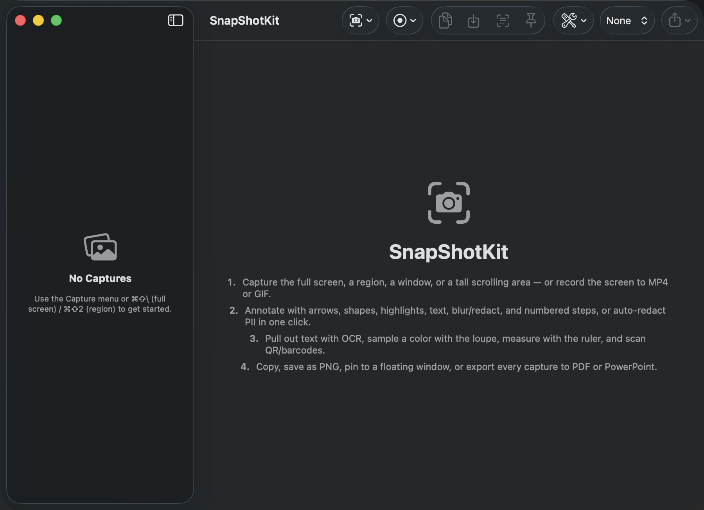
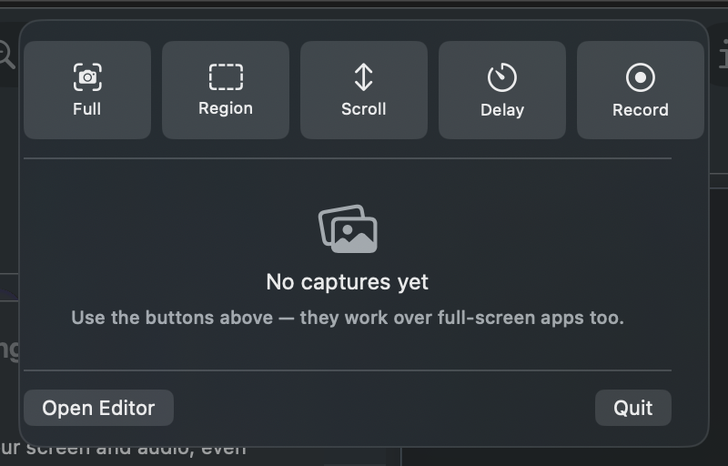

# SnapShotKit

**Capture, annotate, and share beautiful screenshots — natively on your Mac.**

SnapShotKit is a free, open-source macOS app for taking screenshots, marking them
up with arrows, shapes, text, highlights and redactions, and exporting them as
polished images or multi-page PDFs. It's built entirely with Apple frameworks —
no third-party dependencies, no telemetry, no cloud. Everything runs locally.

<p align="center">
  
</p>

---

## Features

### Capture

- **Full screen** — grab the entire display with a single shortcut.
- **Region** — drag to select any rectangular area of the screen.
- **Window** — capture a specific application window.
- **Timed** — start a short countdown, then capture (handy for menus and hover states).
- **Scrolling capture** — stitch a long, scrollable page into a single tall image that
  reaches well beyond what fits on screen.
- **Screen recording** — record the screen to video, then export the result as an
  animated **GIF** for lightweight sharing.
- **Hide desktop icons** — optionally clear desktop clutter before a capture for a
  clean, distraction-free shot.

### Annotate

- **Arrow**, **Rectangle**, **Ellipse**, and **Line** shapes.
- **Freehand pen** for quick sketches.
- **Text** labels.
- **Highlight** to draw attention to a region.
- **Numbered steps** for walkthroughs and tutorials.
- **Blur / redaction** to hide sensitive information.
- **Auto-redact PII** — detect and mask emails, phone numbers, credit-card numbers,
  Social Security numbers, API keys, and faces in a single pass.
- Adjustable **color** and **thickness**, with full **undo / redo**.

### Output

- **Copy to clipboard** for instant pasting.
- **Save as PNG**, or **quick-save to the Desktop**.
- **Pretty gradient backgrounds** to make shares look great.
- **Multi-page PDF export** — collect several captures into one document.
- **PowerPoint export** — build a `.pptx` deck from your captures at full image resolution.
- **GIF export** — turn a screen recording into a shareable animated GIF.

### Extras

- **OCR** — copy selectable text straight out of any screenshot.
- **QR & barcode scanning** — detect and read QR codes and barcodes within a capture.
- **Color loupe & pixel ruler** — inspect individual pixels with a magnified loupe and
  read out exact color values in **HEX**, **RGB**, and **HSL**.
- **Recents persistence** — recently captured items are remembered across launches.
- **Pin** a screenshot as a floating always-on-top window for reference.
- **Global hotkeys** — `⌘⇧\` for full screen, `⌘⇧2` for region.
- **Menu-bar app** — capture and manage shots without a Dock icon in the way.

---

## Requirements

| Requirement | Details                                  |
| ----------- | ---------------------------------------- |
| macOS       | 14.0 (Sonoma) or later                   |
| Toolchain   | Swift 6 / Xcode 16+ (to build from source) |
| Frameworks  | Apple-only — SwiftUI, AppKit, ScreenCaptureKit, PDFKit, Vision, CoreImage |

There are **no external Swift Package Manager dependencies**. SnapShotKit relies
solely on frameworks that ship with macOS.

---

## Build & Run

SnapShotKit is a Swift Package executable. From the project root:

```bash
# Compile the executable
swift build

# Build a double-clickable SnapShotKit.app bundle
bash make-app.sh
```

Then launch the bundled app:

```bash
open SnapShotKit.app
```

Prefer Xcode? Just open the package directory and run the `SnapShotKit` scheme:

```bash
open Package.swift
```

---

## Permissions

SnapShotKit uses Apple's modern **ScreenCaptureKit** API, which requires the
**Screen Recording** permission.

The first time you trigger a capture, macOS will prompt you to grant access. To
enable it manually (or if you missed the prompt):

1. Open **System Settings → Privacy & Security → Screen Recording**.
2. Enable **SnapShotKit** in the list.
3. Quit and relaunch the app so the new permission takes effect.

The same **Screen Recording** permission also covers screen recording and GIF export.

**Scrolling capture** additionally requires the **Accessibility** permission, which
lets SnapShotKit drive the scroll of the target window while stitching the long image.
Enable it under **System Settings → Privacy & Security → Accessibility**, then quit and
relaunch the app.

SnapShotKit never sends your screenshots anywhere — all capture, editing, OCR,
redaction, and export happen on your machine.

---

## Screenshots

**Menu-bar capture panel** — summon it from anywhere with **⌘⇧Space**. It floats over
full-screen apps, so you can capture, record, annotate, and export without leaving
whatever you're working on.

<p align="center">
  
</p>

---

## Contributing

Contributions are welcome! Bug reports, feature ideas, and pull requests all help
make SnapShotKit better. Please read [CONTRIBUTING.md](CONTRIBUTING.md) to get
started.

---

## License

SnapShotKit is released under the [MIT License](LICENSE).
